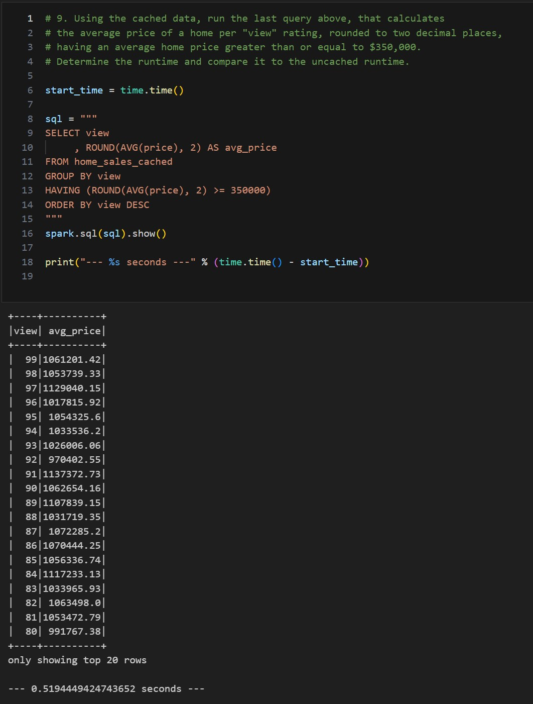

# Home_Sales
In this challenge, you'll use your knowledge of SparkSQL to determine key metrics about home sales data. Then you'll use Spark to create temporary views, partition the data, cache and uncache a temporary table, and verify that the table has been uncached.

### Analysis

[Home Sales Colab Jupyter Notebook](Home_Sales_colab.ipynb)

1. What is the average price for a four-bedroom house sold for each year? Round off your answer to two decimal places.

2. What is the average price of a home for each year it was built that has three bedrooms and three bathrooms? Round off your answer to two decimal places.

3. What is the average price of a home for each year that has three bedrooms, three bathrooms, two floors, and is greater than or equal to 2,000 square feet? Round off your answer to two decimal places.

4. What is the "view" rating for homes costing more than or equal to $350,000? Determine the run time for this query, and round off your answer to two decimal places.
- View data

5. Using the cached data, run the query that filters out the view ratings with an average price of greater than or equal to $350,000. Determine the runtime and compare it to uncached runtime.
Partition by the "date_built" field on the formatted parquet home sales data.

- Cached data

- Parquet formatted data

In my testing, running the queries in Google Colab, The cached data performed the best, followed by Parquet formatted data and then the uncashed original data.

I expected the Parquet formatted data to perform the best, the performance of the data may have been limited due to reading the data from My Google drive.
